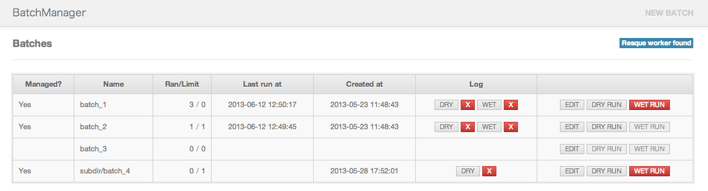

# BatchManager

    

A rails plugin to manage batch scripts. Provide web interface to create, edit and execute batch scripts simply. Automatically save the log to file.

## Installation

Add to your Gemfile

    gem 'batch_manager'

and bundle

    bundle

initialize

    bundle exec rails generate batch_manager:migration
    bundle exec rake db:migrate

This will create a table 'schema_batches' like 'schema_migrations' to save the status of batches in database.

## Configuration

    config.batch_manager.batch_dir = "script/batch"
    config.batch_manager.save_log = true
    config.batch_manager.log_dir = "log/batch"

You can change the default configuration in config/application.rb

## Batch Generator

    bundle exec rails g batch test

This will generate the file 'test.rb' in the configured batch_dir with default template.

### Custom Template

You can simply override the default template by making a template file with the name 'batch.rb' inside lib/templates/rails/batch.

## Batch Header

The generated batch files will have the header like:

    # =Batch Manager=
    # =created_at:  2013-05-24 13:10:25
    # =times_limit: 1

Add the "=Batch Manager=" to tell BatchManager to manage this batch file.

You can also add these headers to the existing batch files.

## Execute Batch

    bundle exec bm_exec [options] BATCH_FILE

Please use this command instead of 'rails runner' to run batch scripts.

    options:
      -f, --force                      Force to run
      -w, --wet                        Wet run
      -d, --daemon COMMAND             Daemon mode

### Daemon mode

Use `-d` option to run batch as daemon.

    # start daemon
    bundle exec bm_exec -d start BATCH_FILE

    # stop daemon
    bundle exec bm_exec -d stop BATCH_FILE

## Logger

Please use BatchManager.logger in batch scripts to output logs, and then BatchManager will automatically also output logs to the file in the configured log directory.

    BatchManager.logger.debug
    BatchManager.logger.info
    BatchManager.logger.warn
    BatchManager.logger.error
    BatchManager.logger.fatal

When batches executed without BatchManager, it will write log to $stdout as default.

## Web interface

Mount the web interface in the routes file.

    mount BatchManager::Engine, :at => "batch_manager"

You can also use web interface to execute batches.

If [resque](https://github.com/resque/resque) installed in you application and the resque worker started, the batch script can be executed asynchronous through the worker. And the log can be checked on real time in the brower. Otherwise the batch script will be executed synchronous.

The QUEUE's name will be *"batch_manager".*

### Screenshot

## Rake Tasks

show all batches

    bundle exec rake batch:list

show the details of batches

    bundle exec rake batch:details
